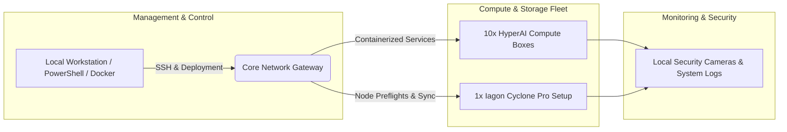

# System Architecture & Topology

This document outlines the dual-layer architecture of the Frank Digital Twin: the cognitive RAG pipeline running on the edge, and the underlying physical infrastructure node deployment.

## 1. Digital Twin & RAG Pipeline Architecture

```mermaid
graph TD
    subgraph Knowledge Base Layer [Markdown & Schema Assets]
        A1[docs/01_bio.md]
        A2[docs/02_case_studies.md]
        A3[docs/03_credentials.md]
        A4[docs/04_research.md]
    end

    subgraph Ingestion Layer
        B[scripts/ingest.js / Python Tools] -->|Parse & Chunk| C[(Cloudflare D1 Database)]
    end

    subgraph Execution Edge (Cloudflare Workers)
        D[User Query / API Request] --> E[src/index.js Worker]
        C -->|Vector/Text Search Match| E
        E -->|Infers & Generates Response| F[Final Output to User]
    end

    A1 --> B
    A2 --> B
    A3 --> B
    A4 --> B
```

---

## 2. Infrastructure & Compute Node Topology


